# Lapres Modul 3 Jarkom 2020 - T1  
`"Repository dibuat untuk memenuhi tugas praktikum mata kuliah komunikasi data dan jaringan komputer tahun 2020."`  
  
Anggota:  
**Adeela Nurul Fadhila** `[05311840000001]` [@Rinnabel](https://github.com/Rinnabel)  
**Muhammad Ilya Asha Soegondo** `[05311840000010]` [@ilyaasha24](https://github.com/ilyaasha24/)  

Asisten:  
**Arino Jenynof** `[05111740000096]`  

Penguji:  
**Ramadhan Ilham Irfany** `[05111740000121]` 

## SOAL NO 1-6

Anri adalah seorang mahasiswa tingkat akhir yang sedang mengerjakan TA mengenai DHCP dan Proxy. Bu Meguri sebagai dosen pembimbing Anri memberikan tugas pertamanya, **(1)** yaitu untuk **membuat topologi jaringan** demi kelancaran TA-nya dengan kriteria sebagai berikut:

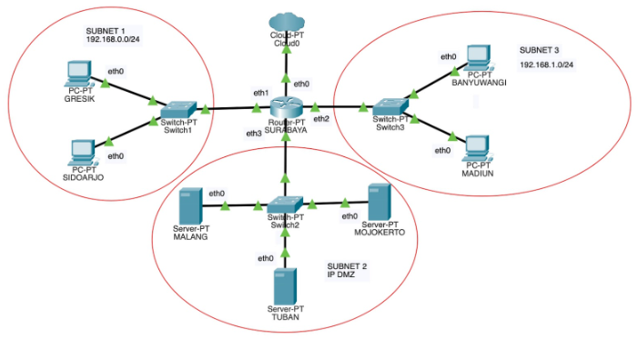

Anri sudah pernah mempelajari teknik Jaringan Komputer sehingga Anri dapat membuat topologi tersebut dengan mudah. Bu Meguri memerintahkan Anri untuk menjadikan **SURABAYA** sebagai router, **MALANG** sebagai DNS Server, **TUBAN** sebagai DHCP server, serta **MOJOKERTO** sebagai Proxy server, dan UML lainnya sebagai client. 
Bu Meguri berpesan pada Anri untuk **menyusun topologi secara hati-hati** dan **memperhatikan gambar topologi** yang diberikan Bu Meguri. 
Karena **TUBAN** jauh dari client, maka perlu adanya perantara agar bisa saling terhubung. **(2) SURABAYA** ditunjuk sebagai perantara **(DHCP Relay)** antara DHCP Server dan client.
Kriteria lain yang diminta Bu Meguri pada topologi jaringan tersebut adalah:
1. Seluruh client **TIDAK DIPERBOLEHKAN** menggunakan konfigurasi IP Statis.
2. **(3)** Client pada subnet 1 mendapatkan range IP dari 192.168.0.10 sampai 192.168.0.100 dan 192.168.0.110 sampai 192.168.0.200.
3. **(4)** Client pada subnet 3 mendapatkan range IP dari 192.168.1.50 sampai 192.168.1.70.
4. **(5)** Client mendapatkan DNS Malang dan DNS 202.46.129.2 dari DHCP
5. **(6)** Client di subnet 1 mendapatkan peminjaman alamat IP selama 5 menit, sedangkan **(6)** client pada subnet 3 mendapatkan peminjaman IP selama 10 menit.

## JAWABAN NO 1-6

* Pertama, kita buat topologi sesuai dengan gambar yang telah diberikan.

    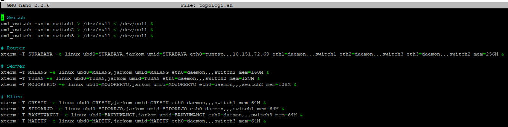

* Selanjutnya jalankan topologi dengan menggunakan perintah `bash topologi.sh`. Tunggu hingga topologi terbuka
* Buka router SURABAYA dan ketikkan    `nano /etc/sysctl.conf`. Hilangkan tanda # pada bagian `net.ipv4.ip_forward=1`. Selanjutnya ketikkan `sysctl -p` untuk mengaktifkan perubahan

    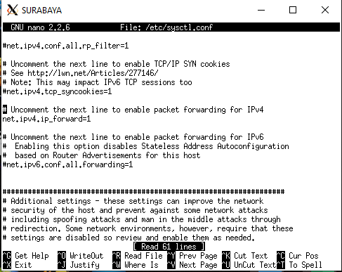

* Kemudian setting IP pada masing-masing UML router dan server saja dengan mengetikkan `nano /etc/network/interfaces`. Untuk client kita setting belakangan setelah DHCP selesai diatur.

**SURABAYA (Sebagai Router)**

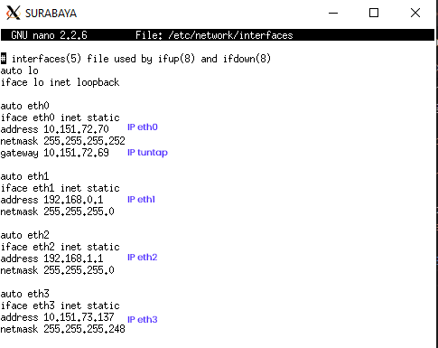

**MALANG (Sebagai Server)**

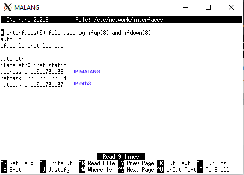

**MOJOKERTO (Sebagai Server)**

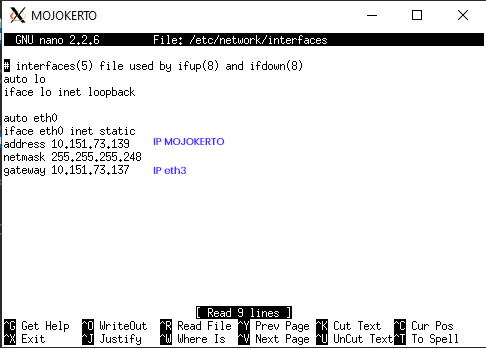

**TUBAN (Sebagai Server)**


* Restart network dengan mengetikkan `service networking restart` di setiap UML.
* Ketikkan **`iptables –t nat –A POSTROUTING –o eth0 –j MASQUERADE –s 192.168.0.0/16`** pada router SURABAYA, agar bisa mengakses jaringan ke luar.
* Selanjutnya, karena SURABAYA ditunjuk menjadi DHCP relay, maka kita perlu menginstall DHCP relay di situ. Pertama, ketikkan `apt-get update` kemudian ketikkan `apt-get install isc-dhcp-relay`. Maka akan muncul beberapa tampilan.
* Ketikkan IP TUBAN

    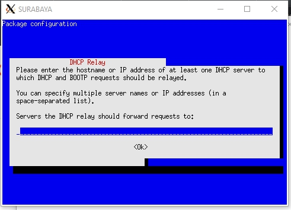

* Ketikkan eth1 eth2 eth3

    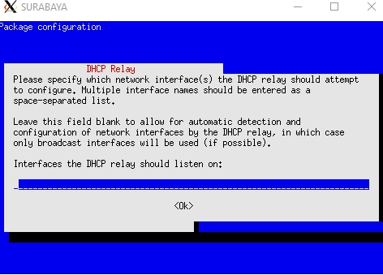

* Biarkan kosong dan langsung tekan enter

    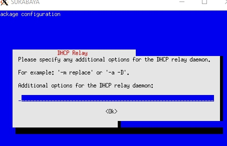

* Ketika instalasi selesai, restart dengan menggunakan perintah `service networking restart`
* Sekarang kita pindah ke DHCP server yaitu **TUBAN**. Update package lists di server **TUBAN** dengan perintah `apt-get update`. Tunggu hingga selesai kemudian Install isc-dhcp-server dengan mengetikkan `apt-get install isc-dhcp-server`.
* Selanjutnya adalah menentukan interface mana yang ajan diberi layanan DHCP. Buka file konfigurasi interface dengan perintah `nano /etc/default/isc-dhcp-server`
* Scroll sampai ke baris paling bawah, lalu edit menjadi `INTERFACES="eth0 eth1 eth2 eth3"`

    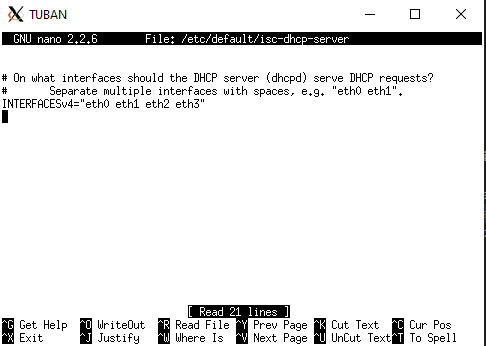

* Buka file konfigurasi DHCP dengan perintah `nano /etc/dhcp/dhcpd.conf`, lalu tambahkan script seperti pada gambar

    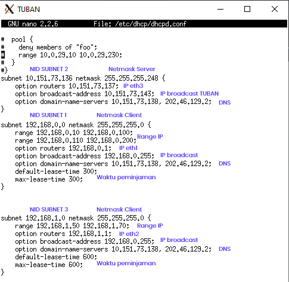

* Restart service isc-dhcp-server dengan perintah `service isc-dhcp-server restart`
* Jika terjadi **failed!**, maka stop dulu, kemudian start kembali
    ```
    service isc-dhcp-server stop
    service isc-dhcp-server start
    ```
* Setelah mengonfigurasi server, kita juga perlu mengonfigurasi interface client supaya bisa mendapatkan layanan dari DHCP server. Di dalam topologi ini, clientnya adalah **GRESIK, SIDOARJO, BANYUWANGI, dan MADIUN**.
* Lakukan konfigurasi interface **GRESIK** dengan menggunakan perintah `nano /etc/network/interfaces`
* Tambahkan :
    ```
    auto eth0
    iface eth0 inet dhcp
    ```

    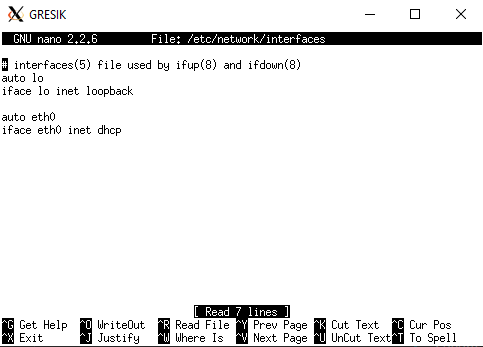

* Restart network dengan perintah `service networking restart`
* Lakukan konfigurasi interface pada client **SIDOARJO, BANYUWANGI, dan MADIUN** dengan cara yang sama seperti **GRESIK**

## SOAL NO 7-12

Bu Meguri adalah dosbing yang suka overthinking. Ia tidak ingin jaringan lokalnya terhubung ke internet secara langsung. Sehingga ia memberi tugas tambahan pada Anri untuk membuatkan Proxy sebagai penghubung jaringan lokal ke internet. Ada beberapa ketentuan yang harus dipenuhi dalam pembuatan Proxy ini.

Pertama, akses ke proxy **hanya bisa dilakukan** oleh Anri sendiri sebagai user TA. **(7)** User autentikasi milik Anri memiliki format:
* User : userta_yyy
* Password : inipassw0rdta_yyy

**Keterangan** : yyy adalah nama kelompok masing-masing. Contoh: **userta_c01**

Anri sudah menjadwal pengerjaan TA-nya **(8)** setiap hari **Selasa-Rabu pukul 13.00-18.00**. Bu Meguri membatasi penggunaan internet Anri hanya pada jadwal yang telah ditentukan itu saja. Maka diluar jam tersebut, Anri tidak dapat mengakses jaringan internet dengan proxy tersebut. Jadwal bimbingan dengan Bu Meguri adalah **(9)** setiap hari **Selasa-Kamis pukul 21.00 - 09.00** keesokan harinya **(sampai Jumat jam 09.00)**. Agar Anri bisa fokus mengerjakan TA, **(10)** setiap dia **mengakses google.com, maka akan di redirect menuju monta.if.its.ac.id** agar Anri selalu ingat untuk mengerjakan TA🙂.

Untuk menandakan bahwa Proxy Server ini adalah Proxy yang dibuat oleh Anri, **(11)** Bu Meguri meminta Anri untuk mengubah **error page default squid** menjadi seperti berikut:


**Note** : File error page bisa diunduh dengan cara **wget 10.151.36.202/ERR_ACCESS_DENIED**. Tidak perlu di extract, cukup cp -r

**(12)** Karena Bu Meguri dan Anri adalah tipe orang pelupa, maka untuk memudahkan mereka, Anri memiliki ide ketika menggunakan proxy cukup dengan mengetikkan domain **janganlupa-ta.yyy.pw** dan memasukkan port **8080**.

**Keterangan** : yyy adalah nama kelompok masing-masing. Contoh: **janganlupa-ta.c01.pw**

## JAWABAN
## NO 7
* Lakukan `apt-get update` pada proxy server, yaitu **MOJOKERTO**
* Install squid dengan perintah `apt-get install squid`. Tunggu sampai selesai
* Cek status squid dengan mengetikkan `service squid status`. Jika muncul status **ok** maka instalasi telah berhasil.
* Lakukan backup pada file konfigurasi default yang disediakan Squid.
    ```
    mv /etc/squid/squid.conf /etc/squid/squid.conf.bak
    ```
* Lakukan `apt-get update`, kemudian install `apache2-utils`
    ```
    apt-get install apache2-utils
    ```
* Buat user dan password baru sesuai dengan ketentuan soal, dengan mengetikkan:
    ```
    htpasswd -c /etc/squid/passwd userta_t01
    ```
    Ketikkan password yang diinginkan yaitu __inipassw0rdta_t01__. Jika sudah maka akan muncul notifikasi:

    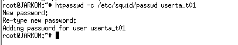

* Buat konfigurasi baru dengan mengetikkan `nano /etc/squid/squid.conf`. Kemudian ketikkan script seperti gambar di bawah

     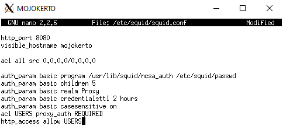

* Restart squid dengan menggunakan perintah `service squid restart`
* Ubah pengaturan proxy browser. Gunakan __IP MOJOKERTO sebagai host__, dan isikan port __8080__.
    
    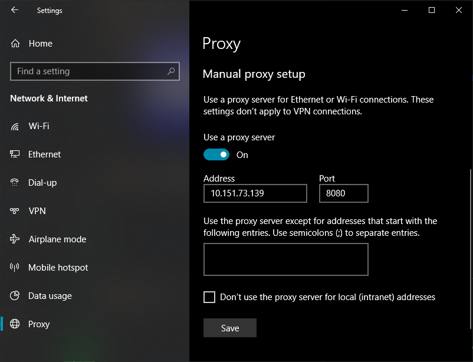

* Kemudian cobalah untuk mengakses web elearning.if.its.ac.id (usahakan menggunakan mode incognito/private), jika muncul pop-up untuk login maka berhasil.

    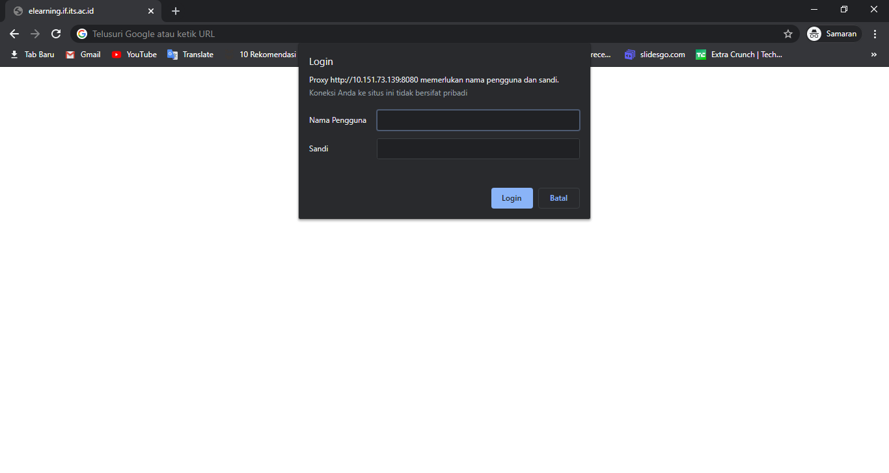

## NO 8 dan 9
* Pada kedua soal ini, permasalahannya adalah sama yaitu pembatasan waktu. Ketentuannya adalah hari __Selasa-Rabu pukul 13.00-18.00 dan Selasa-Kamis pukul 21.00-09.00 keesokan harinya__. Jika akan kita perhatikan lagi, maka pengaturan waktu ini membutuhkan tiga pengaturan, yaitu:
    ```
    Hari Selasa, Rabu pukul 13.0-18.00
    Hari Selasa, Rabu, Kamis pukul 21.00-23.59
    Hari Rabu, Kamis, Jumat pukul 00.00-09.00
    ```
* Buat file baru bernama acl.conf di folder squid dengan menggunakan perintah: `nano /etc/squid/acl.conf`
* tambahkan baris seperti gambar berikut, lalu simpan perubahan

    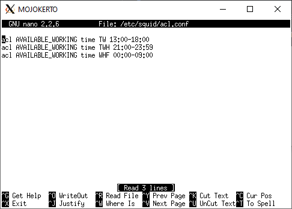

* Buka file squid.conf dengan mengetikkan `nano /etc/squid/squid.conf`. Kemudian tambahkan sedikit konfigurasinya

    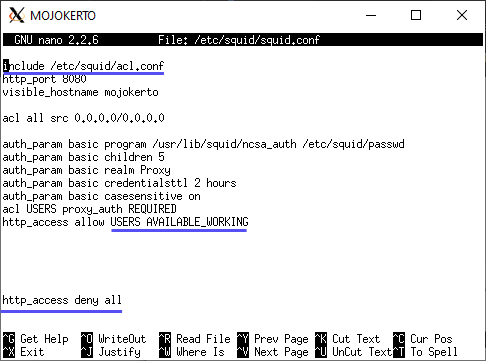

* Simpan file tersebut. Kemudian restart squid.
* Cobalah untuk mengakses web http://its.ac.id (usahakan menggunakan mode incognito/private). Akan muncul halaman error jika mengakses diluar waktu yang telah ditentukan.

    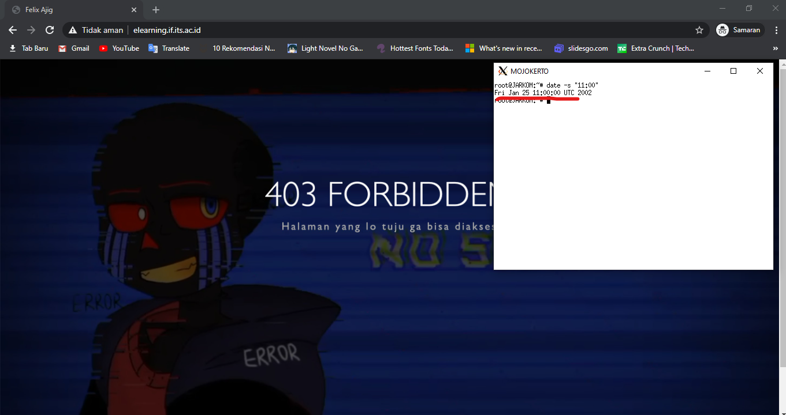

## NO 10
* Buka file squid.conf di MOJOKERTO dengan mengetikkan `nano /etc/squid/squid.conf`. Kemudian tambahkan sedikit konfigurasinya

    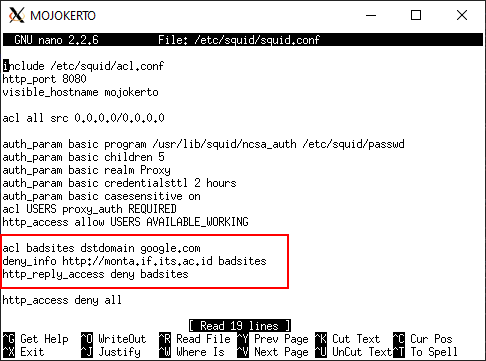

    badsites adalah variabel, sehingga boleh diganti dengan kata lain.

* Mari kita coba dengan mengakses http://google.com. Jika redirect ke monta maka berhasil

    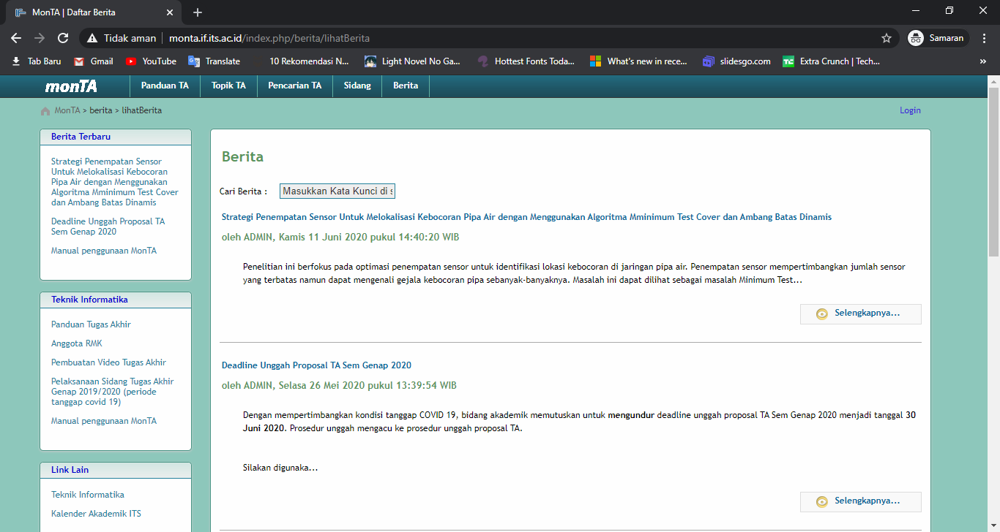

## NO 11
* pertama, pindah ke direktori yang menyimpan default error page
    ```
    cd /usr/share/squid/errors/English/
    ```
* Hapus atau rename (terserah) bernama ERR_ACCESS_DENIED

    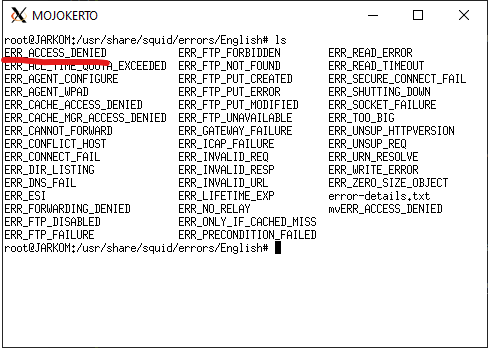

* Lalu jalankan perintah wget 10.151.36.202/ERR_ACCESS_DENIED
* Dan taraaa file-nya sudah otomatis terganti :D

    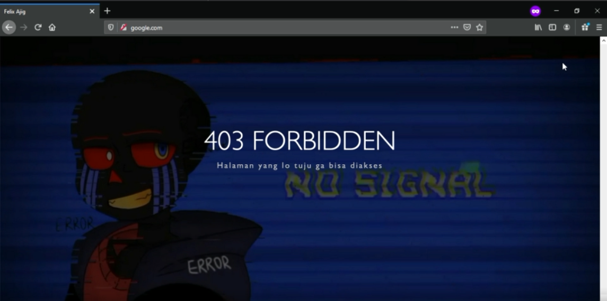

## NO 12
* Sebelum menjalankan UML, ubah konfigurasi pada file VPN. Tambahkan `dhcp-option DNS "IP MALANG TIAP KELOMPOK"` di file .ovpn yang digunakan, hapus profil VPN, dan buat profil VPN baru menggunakan konfigurasi yang ditambahkan

    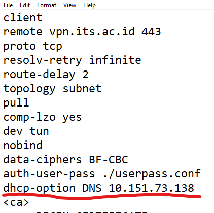

* Pergi ke UML __MALANG__. Kemudian ketikkan `apt-get update`
* Selanjutnya install bind9 dengan perintah `apt-get install bind9 -y`
* Ketikkan `nano /etc/bind/named.conf.local`, lalu isikan konfigurasi sesuai gambar di bawah

    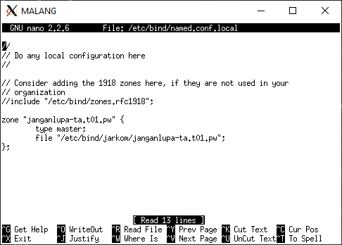

* Buat folder jarkom di dalam /etc/bind
* Copykan file db.local pada path /etc/bind ke dalam folder jarkom yang baru saja dibuat dan ubah namanya menjadi __janganlupa-ta.t01.pw__
    ```
    cp /etc/bind/db.local /etc/bind/jarkom/janganlupa-ta.t01.pw
    ```

* Kemudian buka file __janganlupa-ta.t01.pw__ dengan perintah `nano /etc/bind/jarkom/janganlupa-ta.t01.pw` dan lakukan konfigurasi sebagai berikut

    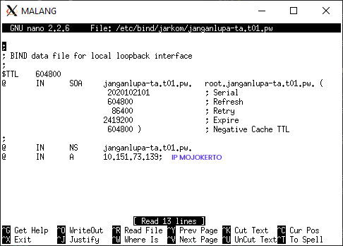

* Restart bind9 dengan perintah `service bind9 restart`
* Selanjutnya kita pindah ke MOJOKERTO dan mengedit file resolv.conf dengan mengetikkan perintah `nano /etc/resolv.conf`

    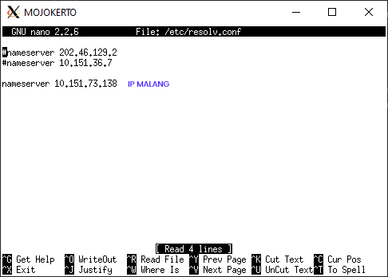

* Selanjutnya kita tes apakah sudah bisa terhubung atau belum dengan menggunakan `ping janganlupa-ta.t01.pw`

    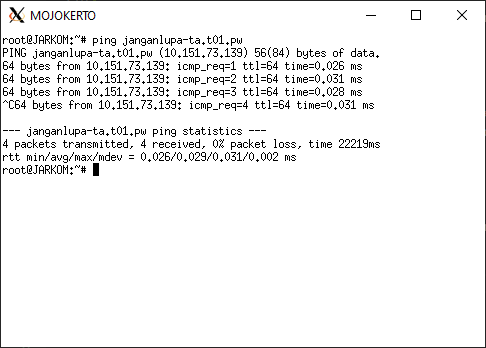
    
* Terakhir, ganti address pada pengaturan proxy browser dengan __`janganlupa-ta.t01.pw`__

    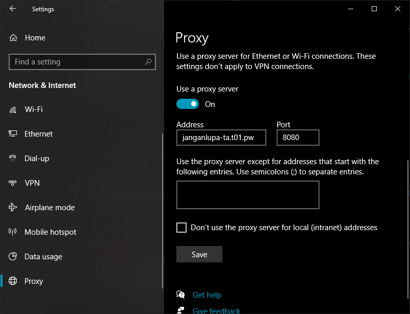

* Yeayy pengaturan domain selesai